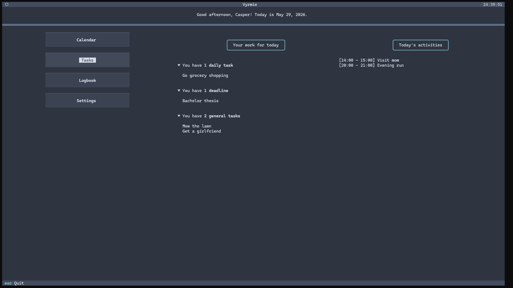
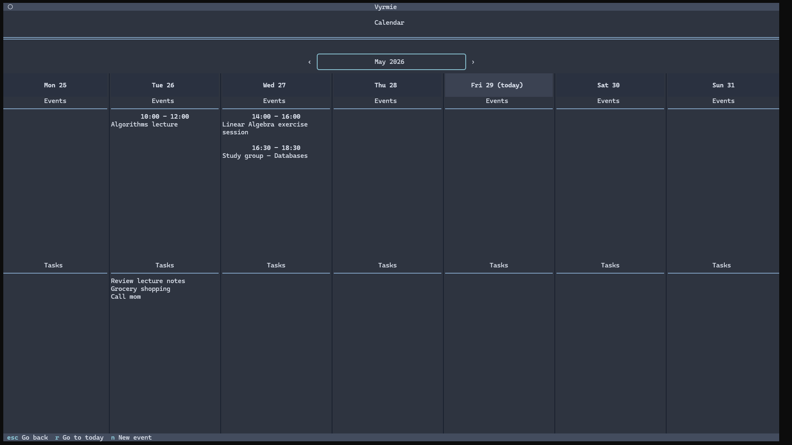
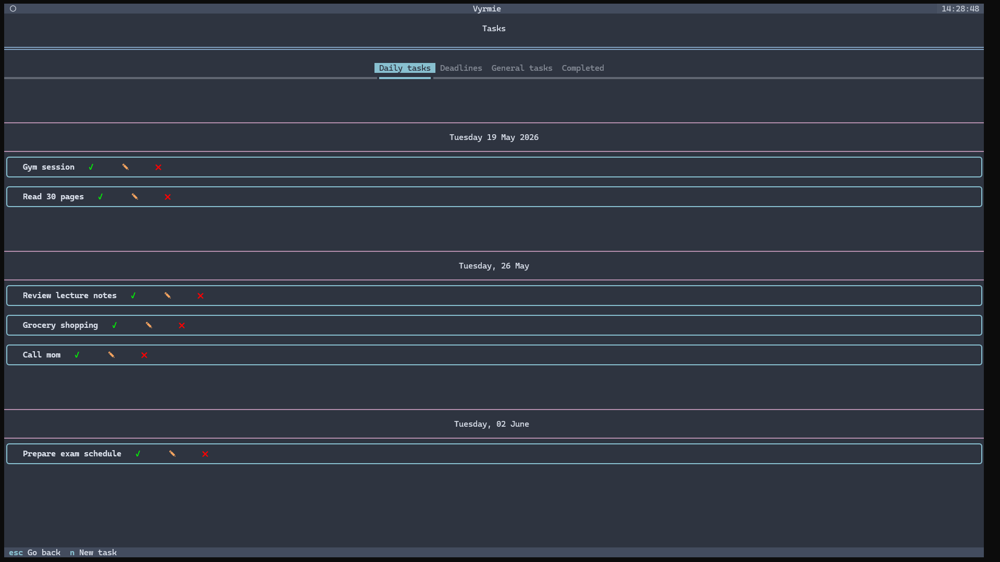
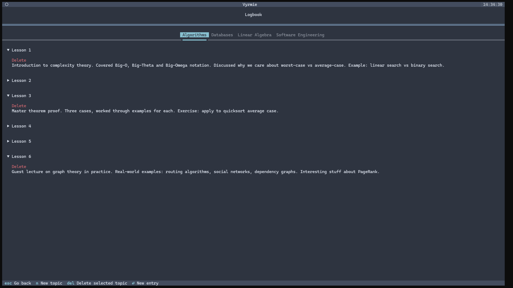

# Vyrmie - Self-organization TUI app built with Textual

Organize your calendar, to-do list, and logs in one sleak, local TUI app.

## How to install

Vyrmie is built with Textual, a Python framework for terminal apps.

1. Make sure you have Python 3.9 or later installed, as well as the _pip_ package manager
2. Open a terminal inside the installation folder and run the following commands

```
pip install -r requirements.txt
python vyrmie.py
```

## Running Vyrmie from a Shortcut

### Windows
1. Right-click your desktop → **New → Shortcut**
2. Paste as the target (adjusting the path to your Python and Vyrmie):
```bat
wt.exe --fullscreen powershell -NoProfile -Command "C:\path\to\python.exe 'C:\path\to\vyrmie.py'"
```
3. Give it a name and optionally set a custom icon.

### macOS
1. Open **Terminal** and create a shell script:
```bash
   echo '#!/bin/bash\nopen -a Terminal python3 /path/to/vyrmie.py' > ~/vyrmie.sh
   chmod +x ~/vyrmie.sh
```
2. Open **Automator** → New Document → **Application**
3. Add a **Run Shell Script** action with: `bash ~/vyrmie.sh`
4. Save it as an `.app` file to your Desktop or Applications folder.

### Linux
1. Create a `.desktop` file:
```bash
   nano ~/.local/share/applications/vyrmie.desktop
```
2. Paste the following (adjusting paths):
```ini
   [Desktop Entry]
   Name=Vyrmie
   Exec=bash -c "python3 /path/to/vyrmie.py"
   Terminal=true
   Type=Application
   Icon=utilities-terminal
```
3. Save and it will appear in your application launcher.

## Feature overview

### Main menu

Vyrmie's main menu acts as a custom home screen for your every day. It lists your daily tasks, deadlines, general tasks, and planned activities.



### Calendar

Click on to reach the calendar, a compact view of any calendar week. It shows all planned activities, deadlines, and daily tasks. Creating a new task or activity is as simple as clicking on a date.



Vyrmie offers many different customizations for your calendar entries:
- Custom name, description, and location
- Single-day activities with start and end times
- Full-day activities
- Multi-day activities
- Activities repeating daily, weekly, monthly or yearly
- Endpoints and exceptions for repeating activities

### Tasks

The task menu allows you to concisely keep track of different task categories: daily tasks, deadlines, and general tasks.



### Logbook

If you're a student, keeping track of short lesson notes per subject is as easy as ever using Vyrmie's logbook feature. Logbook entries can be added under custom topics, which could refer to your subjects.



## Roadmap

- One-button way to save your entire logbook as a printable document for easy reference
- Editing logbook entries
